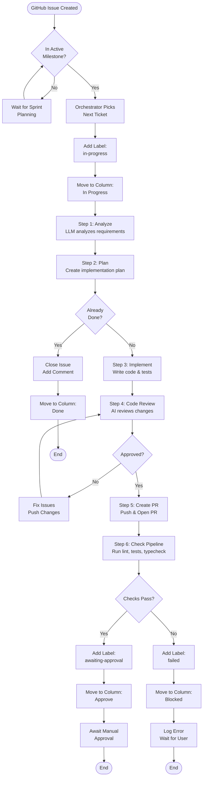
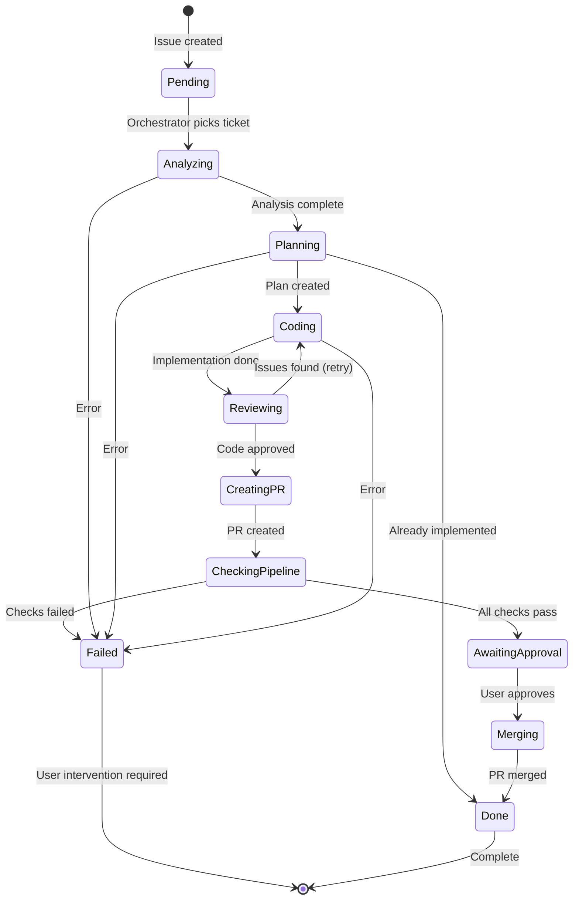

# ODA Ticket Workflow

This document describes the complete lifecycle of a ticket (GitHub Issue) as it flows through the ODA (One Dev Army) system.

## Overview

ODA acts as your automated development team, processing GitHub Issues through a structured pipeline from analysis to PR creation.

## Ticket Lifecycle Flowchart

## State Machine Diagram

## Pipeline Steps Detail

| Step | Name | Description | LLM Role | Status |
|------|------|-------------|----------|--------|
| 1 | **Analyze** | Reads issue, analyzes codebase, identifies files to change | Planning LLM | `StatusAnalyzing` |
| 2 | **Plan** | Creates step-by-step implementation plan | Planning LLM | `StatusPlanning` |
| 3 | **Implement** | Writes code, creates tests, runs test command | Epic Analysis LLM | `StatusCoding` |
| 4 | **Code Review** | AI reviews code for correctness, quality, security | Planning LLM | `StatusReviewing` |
| 5 | **Create PR** | Pushes branch to GitHub, opens pull request | - | `StatusCreatingPR` |

## Error Handling

### Retry Logic
- **Code Review**: If review finds issues, fixes are applied and review re-runs
- **Max Retries**: Unlimited retries for code review fixes (until approved or manually stopped)

### Failure States
When any step fails:
1. Label `in-progress` is removed
2. Label `failed` is added
3. Issue moved to **Blocked** column
4. Error logged to console and database
5. Orchestrator waits for user intervention

### Already Done Detection
Both planning and code review stages check if the issue is already implemented:
- If detected, issue is closed automatically with explanatory comment
- Moved to **Done** column

## GitHub Integration

### Labels Managed by ODA
| Label | Purpose |
|-------|---------|
| `in-progress` | Ticket is being processed |
| `awaiting-approval` | PR created, waiting for manual merge |
| `failed` | Processing failed, needs attention |
| `merge-failed` | Previous merge attempt failed (cleared on retry) |

### Project Board Columns
| Column | Meaning |
|--------|---------|
| **In Progress** | Active development |
| **Approve** | PR ready, awaiting manual approval |
| **Blocked** | Failed or manually blocked issues |
| **Done** | Completed or closed as already done |

## Orchestrator Behavior

### Ticket Selection
1. Polls oldest open milestone every 30 seconds
2. Prioritizes tickets that unblock most dependencies
3. Considers priority labels (high > medium > low)
4. Skips epics (tracking issues)
5. Resumes in-progress tickets on restart

### Blocking Logic
Issues with these labels block new work:
- `awaiting-approval` - Unmerged PR exists
- `failed` - Needs user intervention
- Manually moved to **Blocked** column

### Resume Capability
- Progress saved to SQLite database after each step
- On restart, resumes from last completed step
- Branch and worktree preserved across restarts

### Milestone Auto-Detection

The sync service automatically detects when a new sprint (milestone) is created:
- Every 30 seconds, checks if the oldest open milestone has changed
- When a new sprint is detected, immediately switches to sync issues from the new sprint
- No restart required - seamless transition between sprints
- Orchestrator independently fetches the latest milestone each iteration
